# Self-guided Lab: Introduction to U-SQL

# Introduction

The purpose of this lab is to give you a taste of the new Big Data query language, U-SQL, by taking
you through the journey of using Azure Data Lake Tools for Visual Studio to run your first U-SQL scripts.

# What is U-SQL?
U-SQL is the Big Data query language of the Azure Data Lake Analytics (ADLA) service. 

U-SQL evolved from an internal Microsoft Big Data query language called SCOPE. 
It combines a familiar SQL-like declarative language with the extensibility and programmability provided by C# types 
and the C# expression language, together with support for Big Data processing concepts such as "schema on reads", 
custom processors and reducers.

U-SQL is however not ANSI SQL nor is it Transact-SQL. For starters, its keywords such as SELECT have to be in UPPERCASE. 
U-SQL uses the C# type system. Within SELECT clauses, WHERE predicates, and so on, U-SQL uses C# expressions. 
This means the data types are C# types and use C# NULL semantics, and the comparison operators within a predicate 
follow C# syntax (e.g., `a == "foo"`).

#How do I write U-SQL?
In the current ADLA batch service, U-SQL is written and executed as a batch script. It follows the following general pattern: 

1.	Retrieve data from stored locations in rowset format. These stored locations can be:
	-	Files that will be schematized on read with EXTRACT expressions.
	-	U-SQL tables that are stored in a schematized format.
2.	Transform the rowset(s).
	-	You can compose script multiple transformations over the rowsets in an expression flow format.
3.	Store the transformed rowset data. You can:
	-	Store it in a file with an OUTPUT statement.
	-	Store it in a U-SQL table.

U-SQL also enables you to use data definition statements such as CREATE TABLE to create metadata artifacts.

# Prerequisites
To complete this lab you'll need:

- A copy of Visual Studio 2012 or later with the Azure Data Lake Tools for Visual Studio installed.
- Access to an ADLA account (information on how to get access to an ADLA Account is provided for you [here](https://github.com/Azure/AzureDataLake/blob/master/docs/Hands_on_Labs/Start.md).

# Getting started

In this section you will open Visual Studio and use Azure Data Lake Tools for Visual Studio to create a new U-SQL project.

1. Open Visual Studio and log into your account.
    - On the **File** menu, open **Account Settings**
	  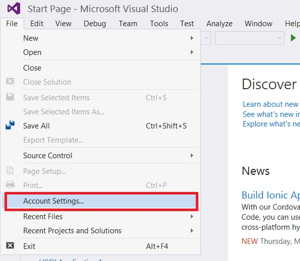
	- Under **All Accounts** select **Sign in** and enter the account information needed to access your ADLA account.
	  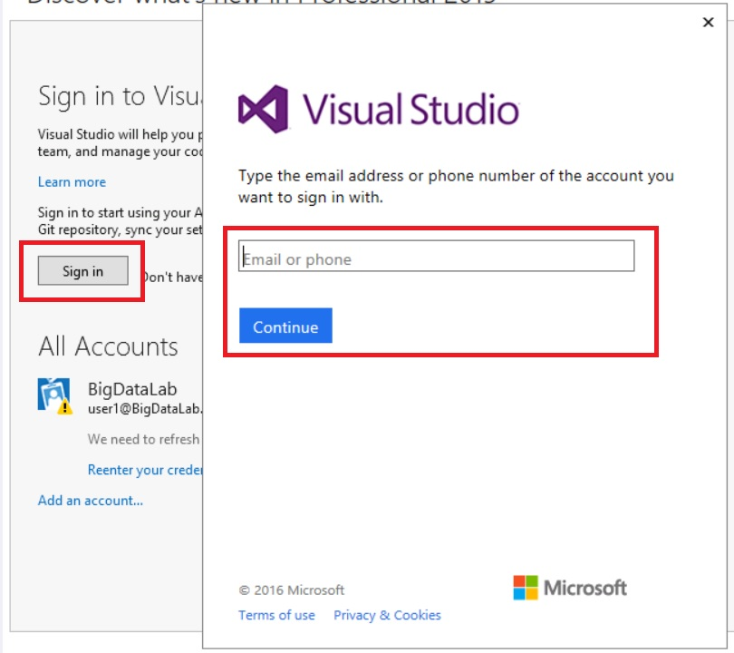
2. Create a new U-SQL project.

    - On the **File** menu, point to **New**, and then click **Project**.
	  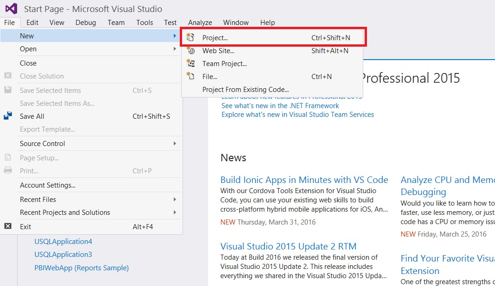
    - In the New Project dialog box, in the navigation pane, expand **Installed**, expand **Templates**, expand **Azure Data Lake**, and then expand **U-SQL**.
	- In the center pane, click **U-SQL Project**.	 
	  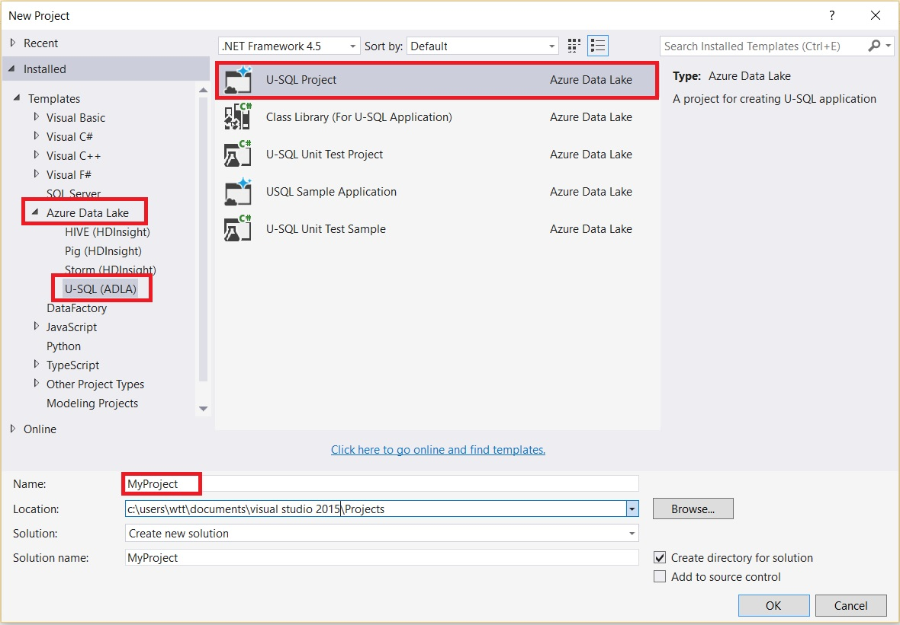
    - In the **Name** box, give your project a name and then click **OK**.

	This may take a bit of time. Once the project is completed, you should now have an empty **Script.usql** window open that you will use to create, edit, and submit your U-SQL scripts.

4. Set the target account to your Azure Data Lake Analytics account (in the example I am using an account named **adlhol**):
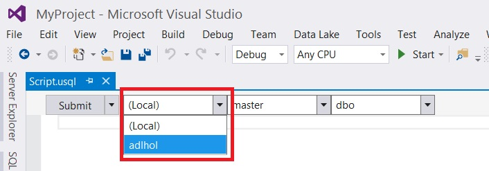

# Exercise 1: Submitting your first U-SQL script
In this exercise you will submit a U-SQL script that reads data from an input file, extracts and schematizes data, and writes the results into an output file.

## Running the script

1. Copy the following U-SQL script into the Script.usql window in Visual Studio:

        @searchlog =
           EXTRACT UserId          int,
                   Start           DateTime,
                   Region          string,
                   Query           string,
                   Duration        int?,
                   Urls            string,
                   ClickedUrls     string
           FROM "/Samples/Data/SearchLog.tsv"
           USING Extractors.Tsv();
        
        OUTPUT @searchlog
        TO "/output/<replace_this_with_your_output_name>.csv"
        USING Outputters.Csv();

2. Change the name of the output file from *&lt;replace_this_with_your_output_name&gt;* to something unique.

	The Script.usql window should resemble the following:
	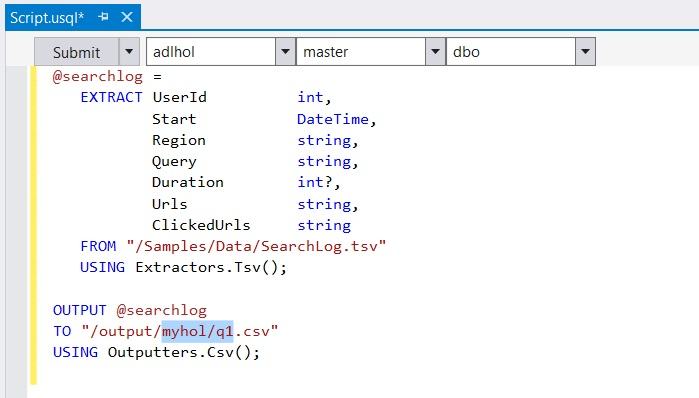

3. To submit your script, click the **Submit** button at the top-left of the Script.usql window.
	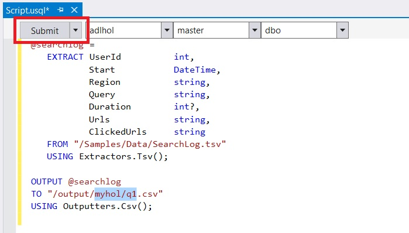

	After a short while, the Job View of the submitted job should appear. 
	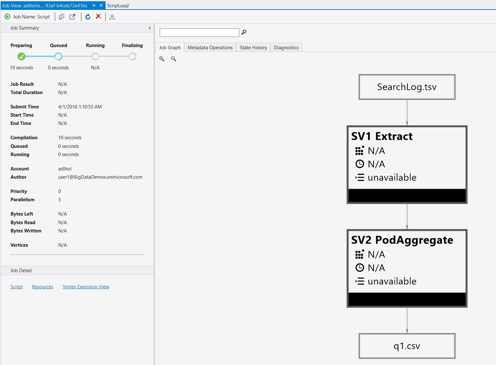

4. Wait until the job has completed. The Job View should resemble the following:
	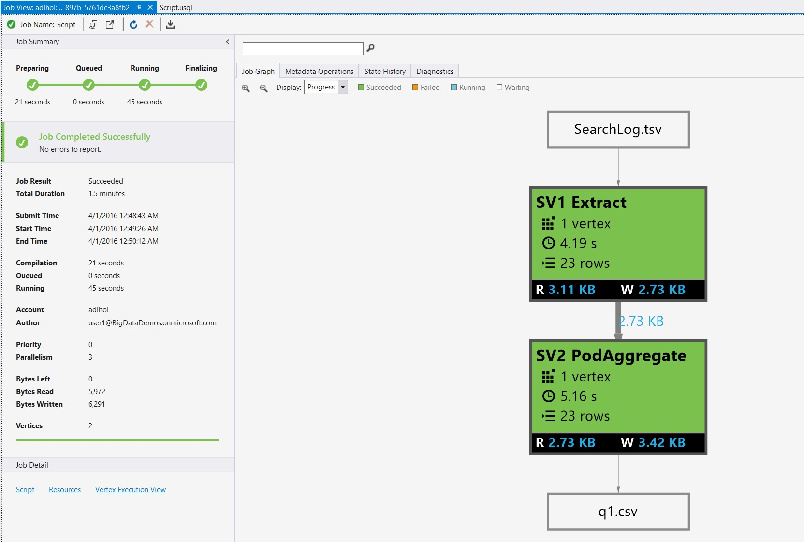

	If the job fails, please look at the **Error** tab and correct the mistake. 
For example, the following error is shown if you did not complete step 2 correctly:
	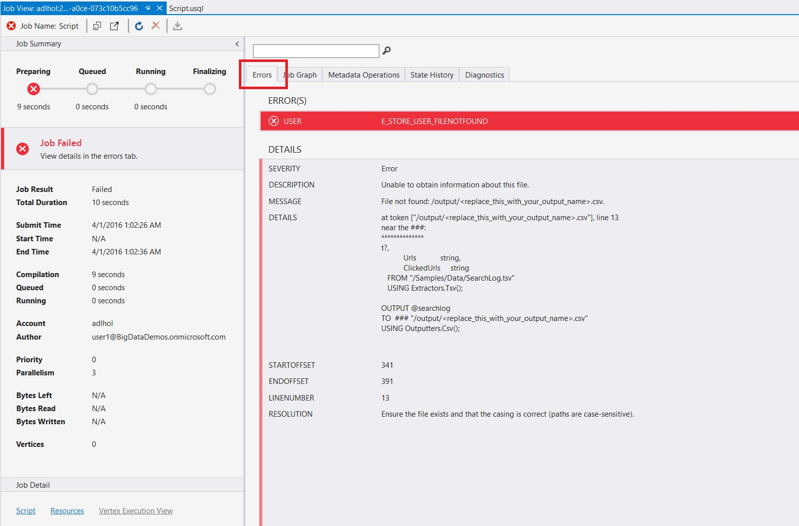

5. Finally check the result by opening the resulting file in the job view:
	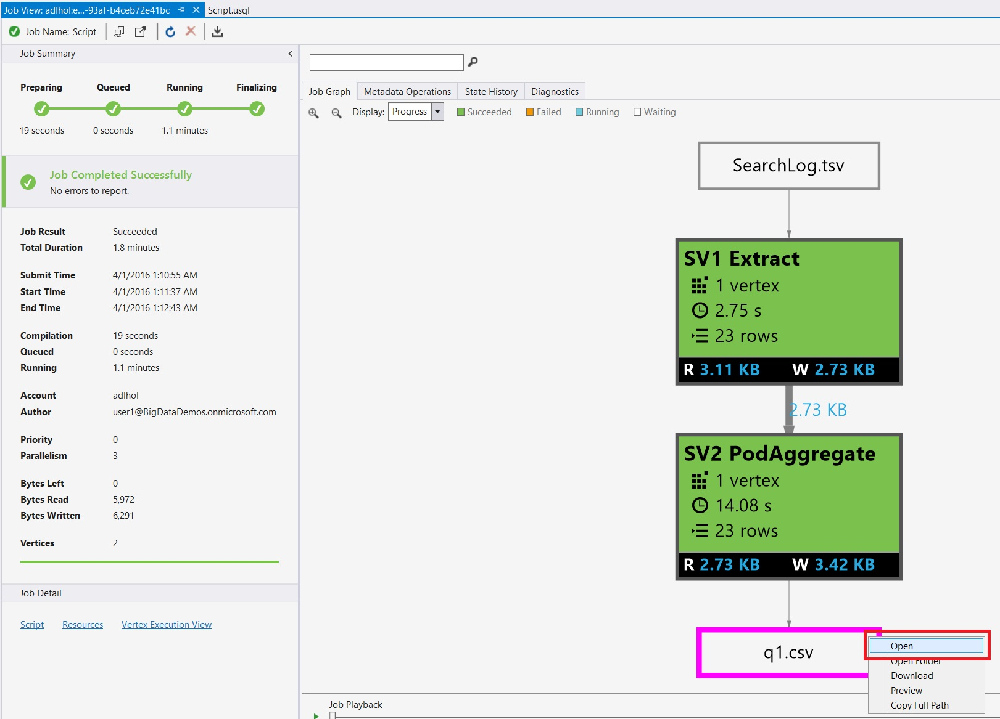

	The resulting file should resemble the following:
	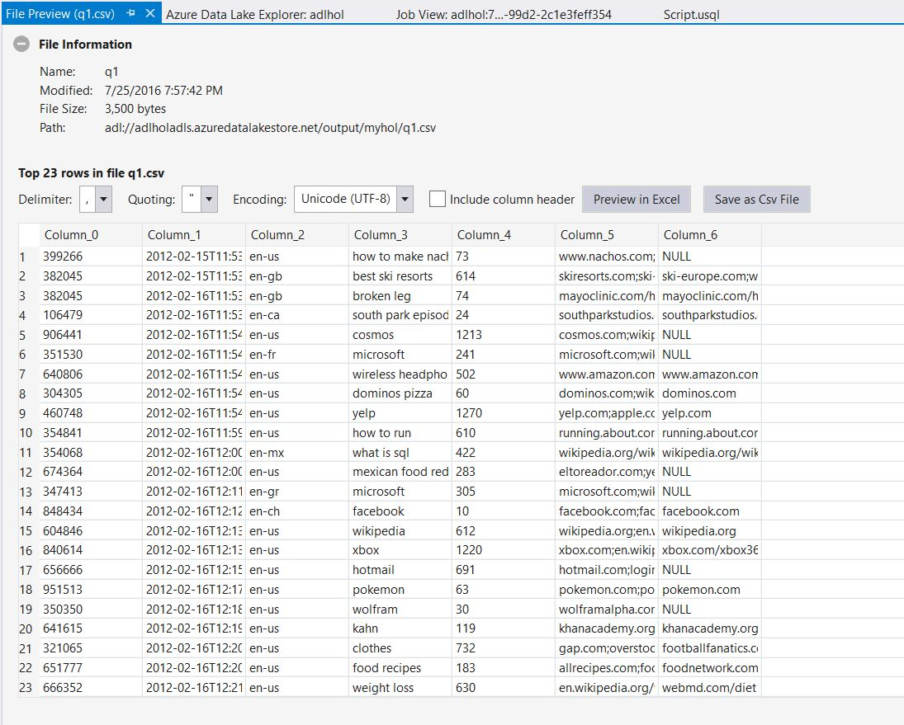

	
> NOTE: This U-SQL script has no transformation step. It reads from an input file called SearchLog.tsv, schematizes the data during the read process, and then outputs the intermediate rowset back into the file whose name you specified. The **Duration** field could be null or of type **int**, while the **UserId** cannot be null. Note that the C# **string** type is always nullable.

This script illustrates the following concepts:

- *Rowset variables*. Each query expression that produces a rowset can be assigned to a variable. Variables in U-SQL follow the T-SQL variable naming pattern of an ampersand (@) followed by a name (**@searchlog** in this case). Note that the assignment statement does not execute the query. It merely names the expression and gives you the ability to build-up more complex expressions.

- *The EXTRACT expression*. This gives you the ability to define a schema as part of a read operation. For each column, the schema specifies a paired value consisting of a column name and a C# type name. It uses a so-called extractor, which can be created or customized by the user. However, in this case  we are using the built-in **Tsv** (tab-separated value) extractor that is provided by the Extractors class, since the input data is not comma but TAB separated.

- *The OUTPUT statement*. This takes a rowset and serializes it as a comma-separated file into the specified location. Like extractors, outputters can be created or customized by the user. However, in this case we are using the built-in **Csv** (comma-separated value) outputter provided by the Outputters class.

Assuming you are using a correctly-provisioned lab account, you should now have a file which contains the result of the query.

# Exercise 2: Using scalar variables
In this exercise, you will introduce scalar variables to make your scripts easier to maintain. You will replace the file paths from the previous exercise with two string variables.

## Running the script

1. Edit the U-SQL script in your Script.usql window to resemble the following:

	    DECLARE @in  string = "/Samples/Data/SearchLog.tsv";
	    DECLARE @out string = "/output/<replace_this_with_your_output_name>.csv";
	   
	    @searchlog =
	        EXTRACT UserId          int,
	                Start           DateTime,
	                Region          string,
	                Query           string,
	                Duration        int?,
	                Urls            string,
	                ClickedUrls     string
	        FROM @in
	        USING Extractors.Tsv();
	   
	    OUTPUT @searchlog   
	    TO @out
	    USING Outputters.Csv();
    
2. As before, change the name of the output file from *&lt;replace_this_with_your_output_name&gt;* to something unique.
3. Submit your script as in Exercise 1, and verify that the result is the same as that of Exercise 1.

# Exercise 3: Transforming your rowset
In this exercise, you will transform your rowset by applying U-SQL SELECT expressions.

First let's do a simple filter. Since the data is in a file and you have to produce a file on output, you will always have an EXTRACT and OUTPUT as part of your U-SQL Script (see later for some different options).

## Running the script

1. Copy the following U-SQL script into the  Script.usql window.

    	@searchlog =
	        EXTRACT UserId          int,
	                Start           DateTime,
	                Region          string,
	                Query           string,
    	            Duration        int?,
	                Urls            string,
	                ClickedUrls     string
	        FROM "/Samples/Data/SearchLog.tsv"
	        USING Extractors.Tsv();
    	
    	@rs1 =
	        SELECT Start, Region, Duration
	        FROM @searchlog
	        WHERE Region == "en-gb";
    	
    	OUTPUT @rs1   
    	TO "/output/<replace_this_with_your_output_name>.csv"
    	USING Outputters.Csv();
    
2. Change the name of the output file from *&lt;replace_this_with_your_output_name&gt;* to something unique.
3. Submit your script  and review the result as explained in Exercise 1. The resulting file should resemble the following: 
	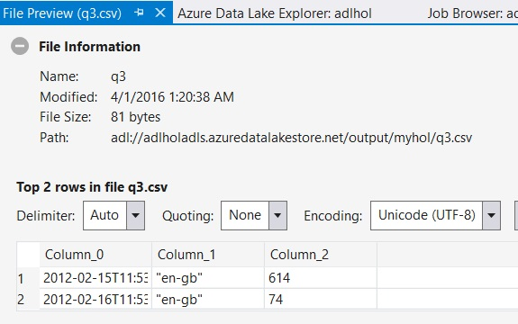

    > Note that the WHERE clause is using a Boolean C# expression and thus the comparison operation is `==` 
	(and not the `=` sign you may be familiar with from traditional SQL).

    You can apply more complex filters by combining them with logical conjunctions (ANDs) and disjunctions (ORs), 
	and you can even use the full power of the C# expression language to create your own expressions and functions. 
	U-SQL supports both `AND` and `OR` keywords (which may reorder the predicate arguments) and `&&` and `||` operators (which provide order guarantee and short cutting).

    The following query makes use of the DateTime.Parse() method (because there is no C# literal for the `DateTime` type) and uses a conjunction.

4. Edit your U-SQL script to resemble the following, and then resubmit the script:

	    @searchlog =
    	    EXTRACT UserId          int,
	                Start           DateTime,
	                Region          string,
	                Query           string,
	                Duration        int?,
	                Urls            string,
	                ClickedUrls     string
	        FROM "/Samples/Data/SearchLog.tsv"
	        USING Extractors.Tsv();
    	
    	@rs1 =
	        SELECT Start, Region, Duration
	        FROM @searchlog
	        WHERE Region == "en-gb";
    	
    	@rs1 =
	        SELECT Start, Region, Duration
	        FROM @rs1
	        WHERE Start >= DateTime.Parse("2012/02/16") AND Start <= DateTime.Parse("2012/02/17");
    	
    	OUTPUT @rs1   
    	TO "/output/<replace_this_with_your_output_name>.csv"
    	USING Outputters.Csv();

Note that the query is operating on the result of the first rowset and thus the result is a composition of the two filters. You can also reuse a variable name and the names are scoped lexically.

The resulting file will look like:
	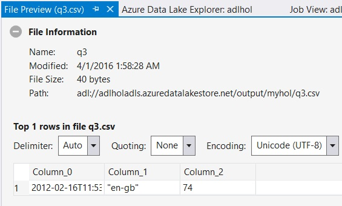

# Exercise 4: Ordering, grouping and aggregating data
In this exercise, you will apply ordering, grouping, and aggregation to control how your output data is presented.

In many cases, you will want to perform some analytics as part of your queries. U-SQL provides you with the familiar ORDER BY, GROUP BY, and aggregation constructs.

## Running the script

1. Copy the following U-SQL script into the Script.usql window.

    	DECLARE @outpref string = "/output/<replace_this_with_your_output_name>";
    	DECLARE @out1    string = @outpref+"_agg.csv";
    	DECLARE @out2    string = @outpref+"_top5agg.csv";
    	
    	@searchlog =
	        EXTRACT UserId          int,
	                Start           DateTime,
	                Region          string,
	                Query           string,
	                Duration        int?,
	                Urls            string,
	                ClickedUrls     string
	        FROM "/Samples/Data/SearchLog.tsv"
	        USING Extractors.Tsv();
    	
    	@rs1 =
	        SELECT
    	        Region,
	            SUM(Duration) AS TotalDuration
	        FROM @searchlog
	        GROUP BY Region;
    	
    	@res =
	        SELECT *
	        FROM @rs1
	        ORDER BY TotalDuration DESC
	        FETCH 5 ROWS;
    	
    	OUTPUT @rs1
    	TO @out1
    	ORDER BY TotalDuration DESC
    	USING Outputters.Csv();
    	
    	OUTPUT @res
    	TO @out2 
    	ORDER BY TotalDuration DESC
    	USING Outputters.Csv();
    
2. Change the name of the output file from *&lt;replace_this_with_your_output_name&gt;* to something unique.
3. Submit your script and review the resulting files as explained in Exercise 1. The two results are:

`_agg.csv`:
	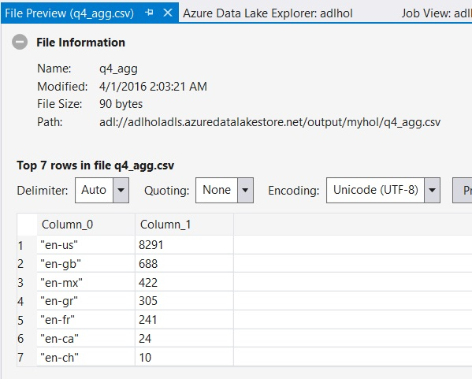

`_top5agg.csv`:
	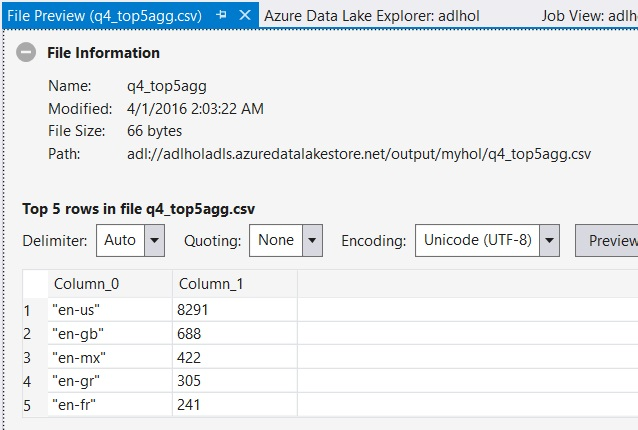
 
	
The query you just submitted finds the total duration per region and then outputs the top five durations in order. Rowsets in U-SQL do not preserve their order for the next query. Thus, if you want an ordered output, you must add the ORDER BY clause to the OUTPUT statement.
	
To avoid giving the impression that the ORDER BY clause in U-SQL provides ordering beyond the ability to take the first or last N rows in a SELECT, you must combine the ORDER BY clause with the FETCH clause in a U-SQL SELECT expression. You can also use the HAVING clause to restrict the output to groups that satisfy the HAVING condition.
	
4. Edit your U-SQL script to resemble the following, and then resubmit the script:

	    @searchlog =
    	    EXTRACT UserId          int,
	                Start           DateTime,
	                Region          string,
	                Query           string,
	                Duration        int?,
	                Urls            string,
	                ClickedUrls     string
	        FROM "/Samples/Data/SearchLog.tsv"
	        USING Extractors.Tsv();
    	
    	@res =
	        SELECT
    	        Region,
	            SUM(Duration) AS TotalDuration
	        FROM @searchlog
	        GROUP BY Region
	        HAVING SUM(Duration) > 200;
    	
    	OUTPUT @res
    	TO "/output/<replace_this_with_your_output_name>.csv"
    	ORDER BY TotalDuration DESC
    	USING Outputters.Csv();
    
The result should resemble the following:
	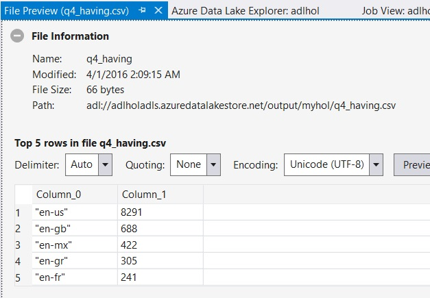

# Exercise 5: Creating and using views
In this exercise, you will create a view to provide abstraction and promote code reuse.

If you don't want to limit yourself to reading from or writing to files, you can use U-SQL metadata objects to add additional abstractions. You create them in the context of a database and a schema. Every U-SQL script will always run with a default database (master) and default schema (dbo) as its default context. You can create your own database and/or schema and can change the context by using the USE statement.

Let's start with encapsulating parts of the queries above for future sharing with views and table-valued functions. You can encapsulate a U-SQL expression in a view for future reuse.
Since we  used the same EXTRACT clause repeatedly in the previous examples, it makes sense to create a view to encapsulate it and store it for reuse in the U-SQL metadata catalog.

## Running the script

1. Replace the content of the Script.usql window with the following U-SQL script, and then submit the script:

	    DROP VIEW IF EXISTS SearchlogView;
	    CREATE VIEW SearchlogView AS  
    	    EXTRACT UserId          int,
	                Start           DateTime,
	                Region          string,
	                Query           string,
	                Duration        int?,
	                Urls            string,
	                ClickedUrls     string
	        FROM "/Samples/Data/SearchLog.tsv"
	        USING Extractors.Tsv();

	The script you just created defines a view named **SearchlogView** in the default database and schema. Note that the first statement drops any existing definitions of the view and then creates the version that we want to use. 

2. The Job View will show an empty job graph, but the Metadata Operations tab will show the operations:
	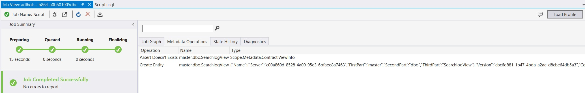

3. Review the registration of the view in Visual Studio's Server Explorer as shown here:
	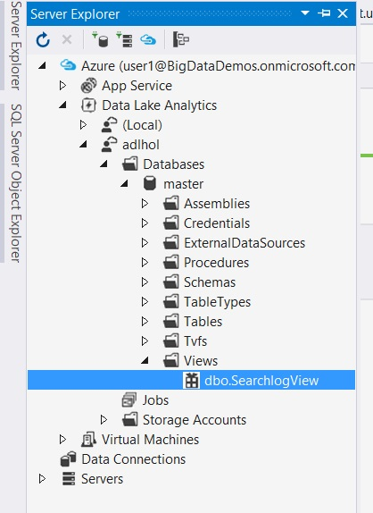

	We can now use the view without having to worry about how to schematize the data in every query. Instead, we can use our new view in place of the EXTRACT expression in the scripts we created earlier.

4. Replace the contents of the Script.usql window with the following text:
	
	    @res =
    	    SELECT
	            Region,
	            SUM(Duration) AS TotalDuration
	        FROM SearchlogView
	        GROUP BY Region
	        HAVING SUM(Duration) > 200;
    	
	    OUTPUT @res
	    TO "/output/<replace_this_with_your_output_name>.csv"
	    ORDER BY TotalDuration DESC
	    USING Outputters.Csv();
    
5. Change the name of the output file from *&lt;replace_this_with_your_output_name&gt;* to something unique, and then submit the script.
	The result should be identical to that of the final step in Exercise 4.
	
# Exercise 6: Creating and using table-valued functions
In this exercise, you will create a table-valued function.

Table-valued functions enable you to create more complex abstractions, by encapsulating several statements and adding parameterization.

## Running the script

1. Replace the contents of the Script.usql window with the following text, and then submit the script:
	
    	DROP FUNCTION IF EXISTS RegionalSearchlog;
    	CREATE FUNCTION RegionalSearchlog(@region string = "en-gb") 
    	RETURNS @searchlog
	    AS BEGIN 
	      @searchlog =
	        SELECT * FROM SearchlogView
	        WHERE Region == @region;
	    END;
    
	The code you just added defines a function named **RegionalSearchlog()** in the default database and schema. The function includes a **@region** parameter that enables you to filter the view you created in the previous step by region. The parameter has a default value of "en-gb". The schema of the TVF is inferred from the final query assigned to **@searchlog**. The first statement drops any existing definitions of the function and then creates the version that we want to use. You can now use the function in your queries.

2. Review the registration in the Visual Studio Server Explorer:
	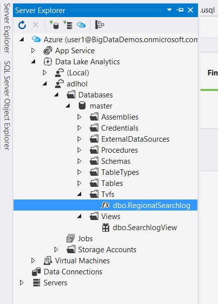

3. Replace the contents of your query editor with the following text:
	
	    @rs1 =
    	    SELECT Start, Region, Duration
	        FROM RegionalSearchlog(DEFAULT) AS S;
    
    	OUTPUT @rs1   
    	TO "/output/<replace_this_with_your_output_name>.csv"
    	USING Outputters.Csv();
	          
    The code you just added retrieves the **Start**, **Region**, and **Duration** fields for the default region.
	
4. Change the name of the output file from *&lt;replace_this_with_your_output_name&gt;* to something unique. 
5. Submit your script and review the result as explained in Exercise 1. The result should resemble the following: 
	
	
# Exercise 7: Creating tables
In this exercise, you will create a table with a predefined schema.

Creating a table with U-SQL is similar to creating a table in a relational database such as SQL Server. You can either create a table with a predefined schema, or create a table and infer the schema from the query that populates the table (also known as CREATE TABLE AS SELECT or CTAS).

One of the benefits of creating a table, rather than a view or a table-valued function, is that the data is stored in an optimized format for the query processor to operate on. The data is indexed, partitioned, and stored in its native data type representation.

You will now persist the searchlog data in a schematized format in a table called Searchlog in your own database. The script will:

- Create a new database (please use your name or another unique name).
- Set the query context to the created database.
- Create tables. To illustrate both ways of creating a table, we create two tables:
    - **SearchLog1** is created with a predefined schema.
	- **SearchLog2** is created based on the view that encapsulates the extraction expression (essentially a CTAS). Note that for scalability, **U-SQL requires you to define the index** for the table before you can insert.
- Insert the data into the **SearchLog1** table.

## Running the script

1. Replace the content of the Script.usql window with the following U-SQL script, and then submit your query:

	    DROP DATABASE IF EXISTS <insert your name>;
	    CREATE DATABASE <insert your name>;
	    USE DATABASE <insert your name>;
	
	    DROP TABLE IF EXISTS SearchLog1;
	    DROP TABLE IF EXISTS SearchLog2;
		
	    CREATE TABLE SearchLog1 (
	                UserId          int,
	                Start           DateTime,
	                Region          string,
	                Query           string,
	                Duration        int?,
	                Urls            string,
	                ClickedUrls     string,
	
	                INDEX sl_idx CLUSTERED (UserId ASC) 
	                      DISTRIBUTED BY HASH (UserId) INTO 4
	      );
	
	    INSERT INTO SearchLog1 SELECT * FROM master.dbo.SearchlogView;
		
	    CREATE TABLE SearchLog2(
                   INDEX sl_idx CLUSTERED (UserId ASC) 
                   DISTRIBUTED BY HASH (UserId) INTO 4
	    ) AS SELECT * FROM master.dbo.SearchlogView; // You can use EXTRACT or SELECT in the AS clause

2. Replace the string *&lt;insert your name&gt;* with a unique database name of your choosing.

3. Review the registration after completion of the job in the Visual Studio Server Explorer (you may need to refresh the Database list):
	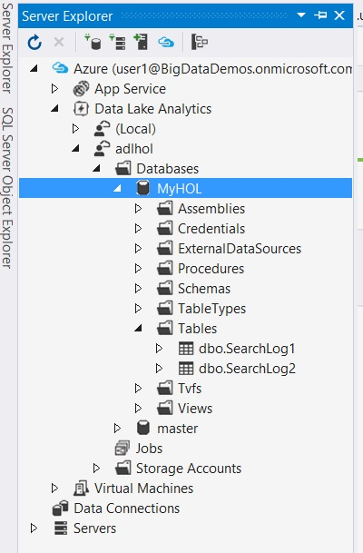
	
You can now query the tables in the same way that you queried the unstructured data. Instead of creating a rowset using EXTRACT, you now can simply refer to the table name.

# Exercise 8: Querying tables
In this exercise, you will query data from the table you created in Exercise 7.

## Running the script

1. Replace the content of the Script.usql window with the following U-SQL script
(update the database name to the name you used in the preceding exercise):
	
	    @rs1 =
	        SELECT
	            Region,
	            SUM(Duration) AS TotalDuration
	        FROM <insert your DB name>.dbo.SearchLog2
	        GROUP BY Region;
    	
    	@res =
	        SELECT *
	        FROM @rs1
	        ORDER BY TotalDuration DESC
	        FETCH 5 ROWS;
    	
    	OUTPUT @res
    	TO "/output/<replace_this_with_your_output_name>.csv"
    	ORDER BY TotalDuration DESC
    	USING Outputters.Csv();
    
    > NOTE: Currently you cannot run a SELECT on a table in the same script as the script where you create that table.

2. Change the name of the output file from *&lt;replace_this_with_your_output_name&gt;* to something unique. 
3. Submit your script and review the result as explained in Exercise 1. The resulting file should contain: 
	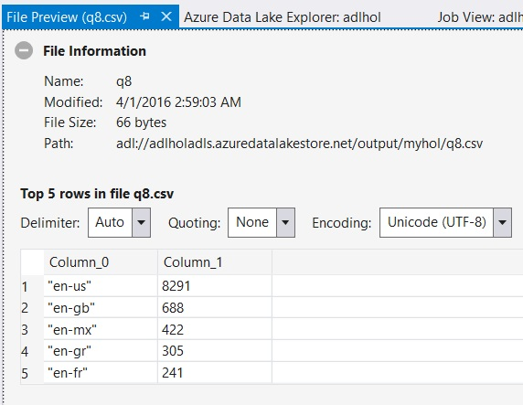
	
# Exercise 9: Joining data
In this exercise, you will use the U-SQL JOIN operator to join data from two different sources and in two different formats. 

U-SQL includes many familiar join operators, such as INNER JOIN, LEFT/RIGHT/FULL OUTER JOIN, SEMI JOIN, and so on. You can use these operators to join not only tables but any rowsets; even those produced from files. You will now use these operators to join the searchlog with an ad impression log to retrieve ads that match a query string for a specified date.

## Running the script

1. Copy the following U-SQL script into the editor of your choice:

	    @adlog =
    	    EXTRACT UserId int,
	                Ad string,
	                Clicked int
	        FROM "/Samples/Data/AdsLog.tsv"
	        USING Extractors.Tsv();
   	
    	@join =
	        SELECT a.Ad, s.Query, s.Start AS Date
	        FROM @adlog AS a JOIN <insert your DB name>.dbo.SearchLog1 AS s 
	                         ON a.UserId == s.UserId
	        WHERE a.Clicked == 1;
    	
    	OUTPUT @join   
    	TO "/output/<replace_this_with_your_output_name>.csv"
    	USING Outputters.Csv();

2. Change *&lt;insert your DB name&gt;* to the name of the database you chose in Exercise 7 and change 
the name of the output file from *&lt;replace_this_with_your_output_name&gt;* to something unique. 
3. Submit your script and review the result as explained in Exercise 1. The resulting file should contain:
	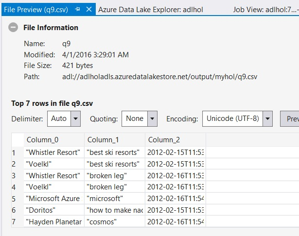

When you work with joins in U-SQL, note that:
- U-SQL only supports the ANSI-compliant JOIN syntax (*Rowset1* JOIN *Rowset2* ON *predicate*). The older syntax (FROM *Rowset1*, *Rowset2* WHERE *predicate*) is not supported.
- The predicate in a JOIN has to be an equality join and no expression. If you want to use an expression, add it to the SELECT clause of a previous rowset. If you want to do a different comparison, you can move it into the WHERE clause.

# Conclusion and more Information

This lab has hopefully given you a small taste of U-SQL. As you would expect, there are many more advanced features that an introductory lab cannot cover, such as:
-	How to use CROSS APPLY to unpack parts of strings, arrays and maps into rows.
-	How to operate over partitioned sets of data (file sets and partitioned tables).
-	How to create your own user-defined operators such as extractors, outputters, processors, aggregators in C#.
-	How to use the U-SQL windowing functions.
-	How to further manage your U-SQL code with views, table-valued functions and stored procedures.
-	How to run arbitrary custom code on your processing nodes.
-	How to connect to SQL Azure databases and federate queries across SQL Azure, U-SQL, and Azure Data Lake data.

You can find further references and documentation at the following locations:

- [Data Lake homepage (with links to documentation)](http://www.azure.com/datalake)
- [U-SQL Reference documentation](http://aka.ms/usql_reference)
- [ADL Tools for VS download page](http://aka.ms/adltoolsVS)
- [Data Lake feedback page](http://aka.ms/adlfeedback)

We hope you come back and use Azure Data Lake Analytics and U-SQL for your Big Data processing needs!
