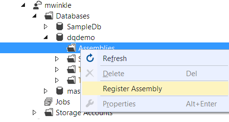

The JSON and XML samples provide two examples of

1. User-defined operators and functions written in C#.
2. Operators that use AtomicFileProcessing to read and write formats that need to read an entire file on the same node.
3. A good start for reading and writing JSON and XML. You can drop these samples right into your project and get started.
 
# Building

This project has been tested to be built from Visual Studio 2015.  Please make sure to install the Azure SDK as well as the Azure Data Lake Tools for Visual Studio.  Once these are installed, you can open the project and build. 

From the command line, once you restore the Nuget packages, you can simply run `msbuild Microsoft.Analytics.Samples.sln` in order to build the project. 

# Deploying

To deploy, you have two options, leveraging the Visual Studio tools, or using the command line tools 

## Deploying with Visual Studio

1. Inside Visual Studio, navigate to your Data Lake Analytics account 
2. Navigate to the database you want to deploy the Assembly


3. Right click and add assembly (you may need to upload the assembly to a location in the store to register it) 



4. Browse to the assembly, and include dependent assemblies (this will pull in the Newtonsoft.Json dll as well) 

 

Alternatively, you can also use U-SQL Code to register your assembly. More information can be found on https://msdn.microsoft.com/en-us/library/azure/mt621364.aspx

# Using in U-SQL
To use in U-SQL, it's fairly straightforward

1. Place ` REFERENCE ASSEMBLY [Newtonsoft.Json]` at the beginning of the script
2. Place `REFERENCE ASSEMBLY [Microsoft.Analytics.Samples.Formats]` at the beginning of your script
3. Leverage one of the extractors, outputters or helper functions inside the library.  

## Using the XML Extractor

The XML Extractor and Outputter are robust implementations of handling XML documents.  Each document will be processed by a single node, and you can very easily provide a map of the values you want to extract that links the column names to the xpath in the document of the element to extract.  The following script will process a dump from wikipedia and extract some interesting data.  YOu can also find more example uses for XML inside the examples directory.


````
// note SQL schema here: https://phabricator.wikimedia.org/diffusion/MW/browse/master/maintenance/tables.SQL
// https://dumps.wikimedia.org/enwiki/latest/enwiki-latest-page.sql.gz
// Note, this one is the big one...
// https://dumps.wikimedia.org/enwiki/latest/enwiki-latest-pages-articles.xml.bz2 
// here are some abstracts in xml
// https://dumps.wikimedia.org/enwiki/latest/enwiki-latest-abstract.xml
// useful refrence here: https://tpmoyer-gallery.appspot.com/hadoopWikipedia 

USE master; 
REFERENCE ASSEMBLY [Microsoft.Analytics.Samples.Formats];

// copy to ADL 

@wiki = 
	EXTRACT title string, 
	link  string,
	abst string
	FROM @"wasb://sampledata@mwinklehdi/wiki/enwiki-latest-abstract.xml" 
	USING new Microsoft.Analytics.Samples.Formats.Xml.XmlExtractor("doc",
		new SQL.MAP<string,string> { 
			 {"title","title" },
			 {"link","link" },
			 {"abstract","abst"}//,
			// {"links", "links"}
			}
	);

@count = SELECT COUNT(DISTINCT title) AS count FROM @wiki; 

@words = SELECT Ar.word, COUNT(*) AS count 
		FROM @wiki
		CROSS APPLY EXPLODE (new SQL.ARRAY<string>(abst.Split(' '))) AS Ar(word)
		GROUP BY Ar.word
		ORDER BY count DESC 
		FETCH FIRST 25 ROWS ; 
		

OUTPUT @count TO @"users/mwinkle/output/wiki/foo1.txt" USING Outputters.Csv();

OUTPUT @words TO @"users/mwinkle/output/wiki/wordCount.txt" USING Outputters.Csv(); 
	

````


## Using the JSON Extractor

The JSON Extractor treats _the entire input file_ as a single JSON document.  If you have a JSON document per line, see the next section. The columns that you try to extract will be extracted from the document.  In this case, I'm extracting out the _id and Revision properties.  Note, it's possible that one of these is a further nested object, in which case you can use the JSON UDF's for subsequent processing. 


````
REFERENCE ASSEMBLY [Newtonsoft.Json];
REFERENCE ASSEMBLY [Microsoft.Analytics.Samples.Formats]; 

//Define schema of file, must map all columns
 @myRecords =
    EXTRACT
        _id string,
	Revision string 	
    FROM @"sampledata/json/{*}.json"
    USING new Microsoft.Analytics.Samples.Formats.Json.JsonExtractor();

````


## Using the JSON UDF's

Here we are using the JSON UDF to take a string of JSON (each line in the file is a JSON document), and convert it into a dictionary from which I extract the values I am interested in.

````
REFERENCE ASSEMBLY [Newtonsoft.Json];
REFERENCE ASSEMBLY [Microsoft.Analytics.Samples.Formats]; 
   

@trial2 = 
	EXTRACT jsonString string FROM @"mafs://accounts/mwinkleadl/fs/sampledata/radiowebsite/{*}.json" USING Extractors.Csv(delimiter:'\b', quoting:false);
	
@cleanUp = SELECT jsonString FROM @trial2 WHERE (!jsonString.Contains("Part: h" ) AND jsonString!= "465}");

@jsonify = SELECT Microsoft.Analytics.Samples.Formats.Json.JsonFunctions.JsonTuple(jsonString) AS rec FROM @cleanUp;

@columnized = SELECT 
			rec["ts"] AS ts,
			rec["userId"] AS userId,
			rec["sessionid"] AS sessionId,
			rec["page"] AS page,
			rec["auth"] AS auth,
			rec["method"] AS method, 
			rec["status"] AS status, 
			rec["level"] AS level,
			rec["itemInSession"] AS itemInSession,
			rec["location"] AS location,
			rec["lastName"] AS lastName,
			rec["firstName"] AS firstName,
			rec["registration"] AS registration,
			rec["gender"] AS gender,
			rec["artist"] AS artist,
			rec["song"] AS song, 
			Double.Parse((rec["length"] ?? "0")) AS length 
	FROM @jsonify; 

````
